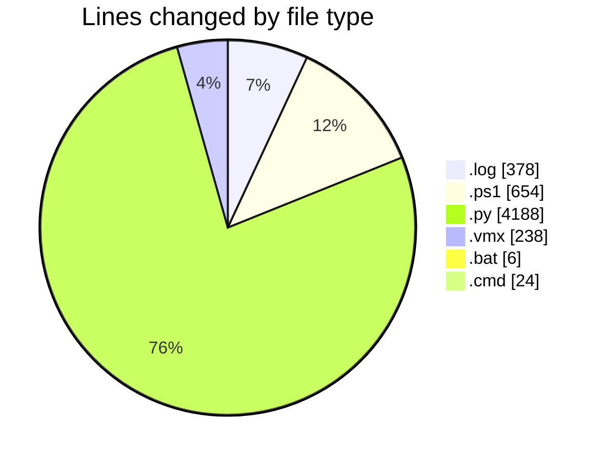
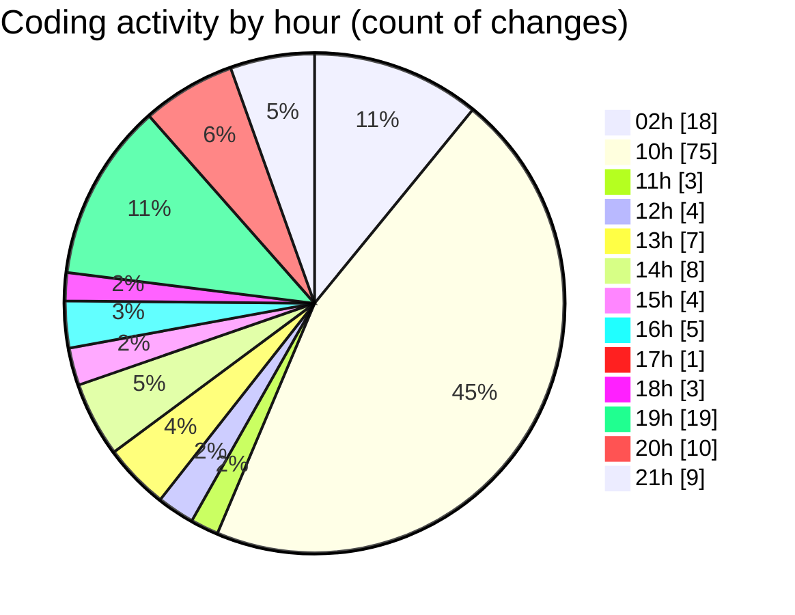

# twenty_versions_aminor - Activity Summary 

## Overall Statistics

| Stat                   | Value                                                             |
| ---------------------- | ----------------------------------------------------------------- |
| **Lines Added** (➕)   | 5410                                          |
| **Lines Removed** (➖) | 78                                        |
| **Net Change** (↕)    | 5332                |
| **Active Time** (⌚)   | 178 minutes |

## Modified Files
- **cubase_extractor.log** (+378, -0)
- **cubase_midi_extractor.ps1** (+654, -0)
- **shibass_project_intelligence_panel.py** (+1049, -0)
- **extractor.py** (+547, -27)
- **parse_links.py** (+25, -0)
- **SHIBASS-CUBASE-MIDI-WORKER.vmx** (+167, -40)
- **SHIBASS-UBUNTU.vmx** (+31, -0)
- **start_services.bat** (+6, -0)
- **test_guest_users.py** (+38, -10)
- **run_and_copy.py** (+49, -1)
- **run.cmd** (+24, -0)
- **gui.py** (+646, -0)
- **run_batch.py** (+112, -0)
- **reports.py** (+586, -0)
- **create_shortcuts.py** (+98, -0)
- **deploy_claude_settings.py** (+115, -0)
- **migrate_to_desktop.py** (+77, -0)
- **deploy_shibass_ai_direct.py** (+124, -0)
- **npm_install_in_guest.py** (+88, -0)
- **fetch_guest_log_locked.py** (+71, -0)
- **list_cubase_child_windows.py** (+81, -0)
- **list_guest_exports.py** (+38, -0)
- **copy_extractor_to_guest_c.py** (+63, -0)
- **check_guest_port_with_file.py** (+47, -0)
- **check_tasklist.py** (+40, -0)
- **check_node_temp.py** (+51, -0)
- **get_vm_screenshot.py** (+24, -0)
- **run_guest_node_debug.py** (+51, -0)
- **deploy_shibass_ai_src.py** (+130, -0)

## Visualizations

### By File Type (Lines Changed)

### By Hour (Estimated Activity Count)

> **Last Updated:** 7/8/2026, 9:43:01 PM