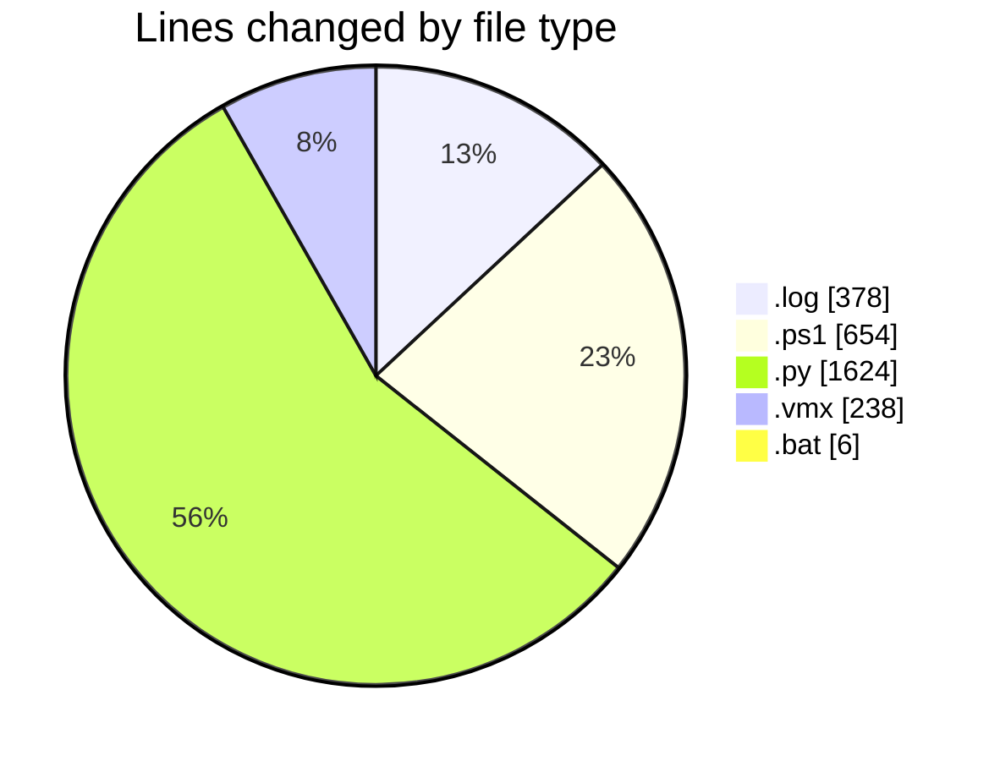
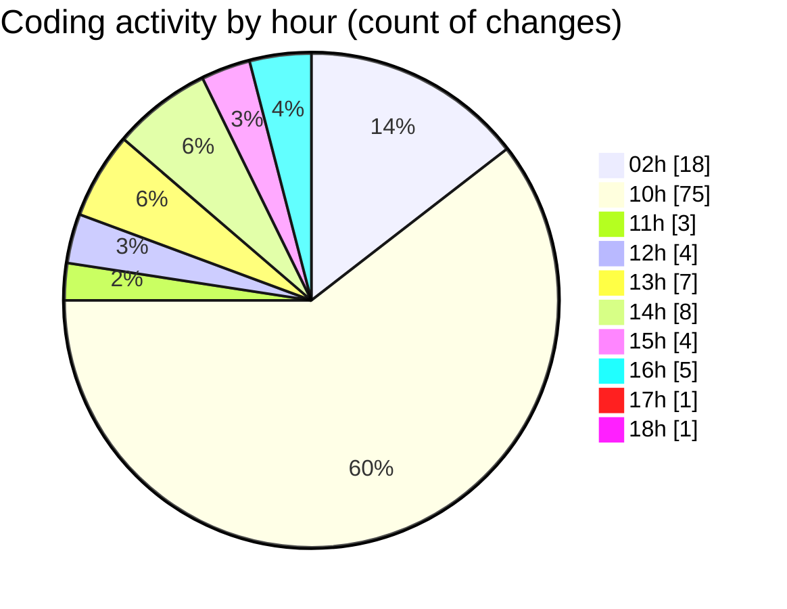

# twenty_versions_aminor - Activity Summary 

## Overall Statistics

| Stat                   | Value                                                             |
| ---------------------- | ----------------------------------------------------------------- |
| **Lines Added** (➕)   | 2827                                          |
| **Lines Removed** (➖) | 73                                        |
| **Net Change** (↕)    | 2754                |
| **Active Time** (⌚)   | 124 minutes |

## Modified Files
- **cubase_extractor.log** (+378, -0)
- **cubase_midi_extractor.ps1** (+654, -0)
- **shibass_project_intelligence_panel.py** (+1049, -0)
- **extractor.py** (+430, -22)
- **parse_links.py** (+25, -0)
- **SHIBASS-CUBASE-MIDI-WORKER.vmx** (+167, -40)
- **SHIBASS-UBUNTU.vmx** (+31, -0)
- **start_services.bat** (+6, -0)
- **test_guest_users.py** (+38, -10)
- **run_and_copy.py** (+49, -1)

## Visualizations

### By File Type (Lines Changed)

### By Hour (Estimated Activity Count)

> **Last Updated:** 7/8/2026, 6:38:01 PM