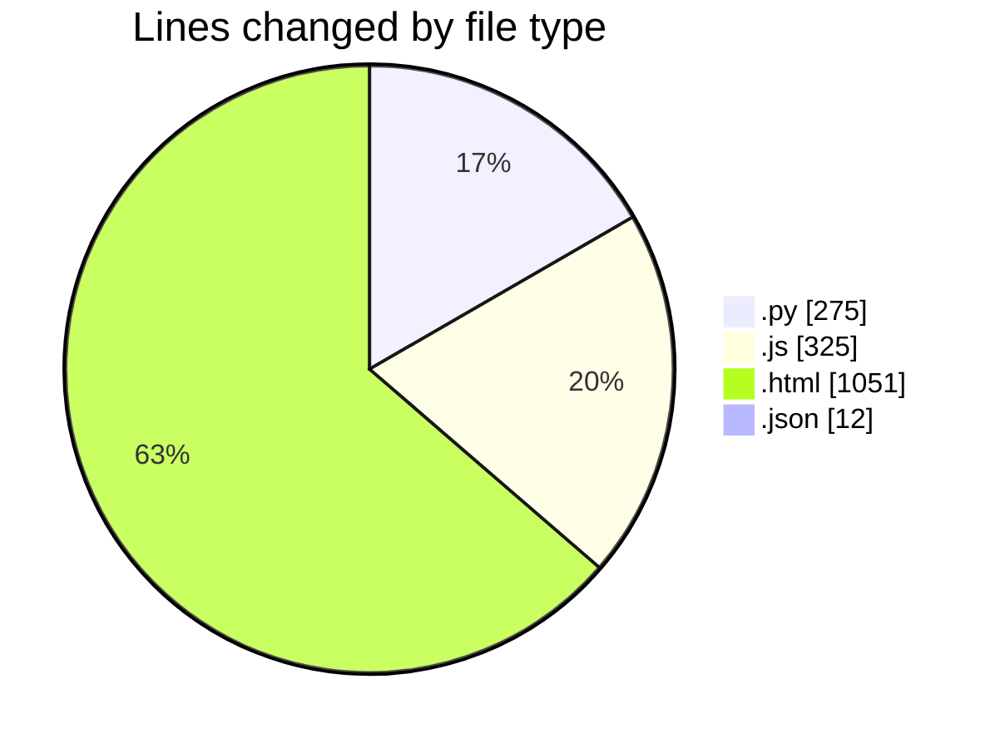
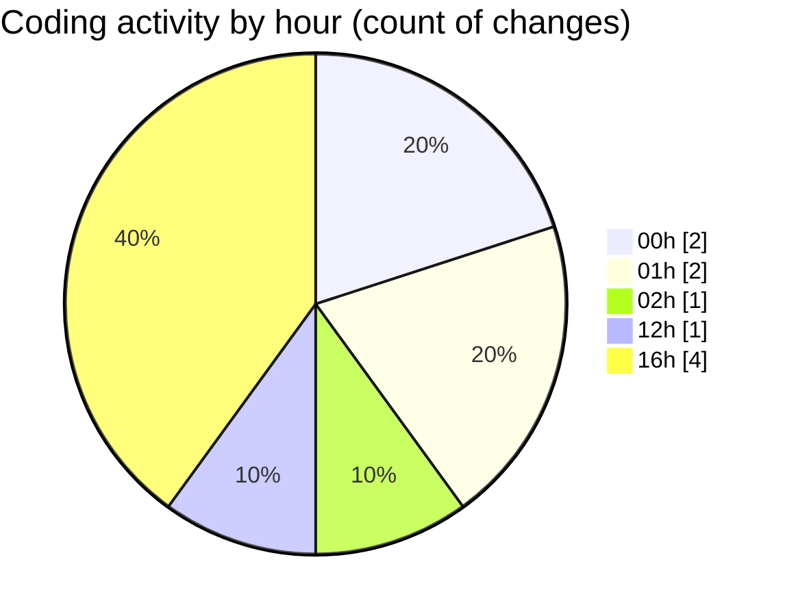

# twenty_versions_aminor - Activity Summary 

## Overall Statistics

| Stat                   | Value                                                             |
| ---------------------- | ----------------------------------------------------------------- |
| **Lines Added** (➕)   | 1592                                          |
| **Lines Removed** (➖) | 71                                        |
| **Net Change** (↕)    | 1521                |
| **Active Time** (⌚)   | 7 minutes |

## Modified Files
- **full_track_assembler.py** (+275, -0)
- **chordEngine.js** (+325, -0)
- **shibass-music-system.html** (+980, -71)
- **settings.json** (+6, -0)
- **settings.json** (+6, -0)

## Visualizations

### By File Type (Lines Changed)

### By Hour (Estimated Activity Count)

> **Last Updated:** 7/9/2026, 4:38:02 PM