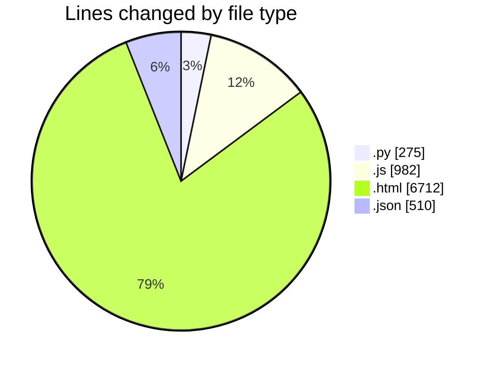
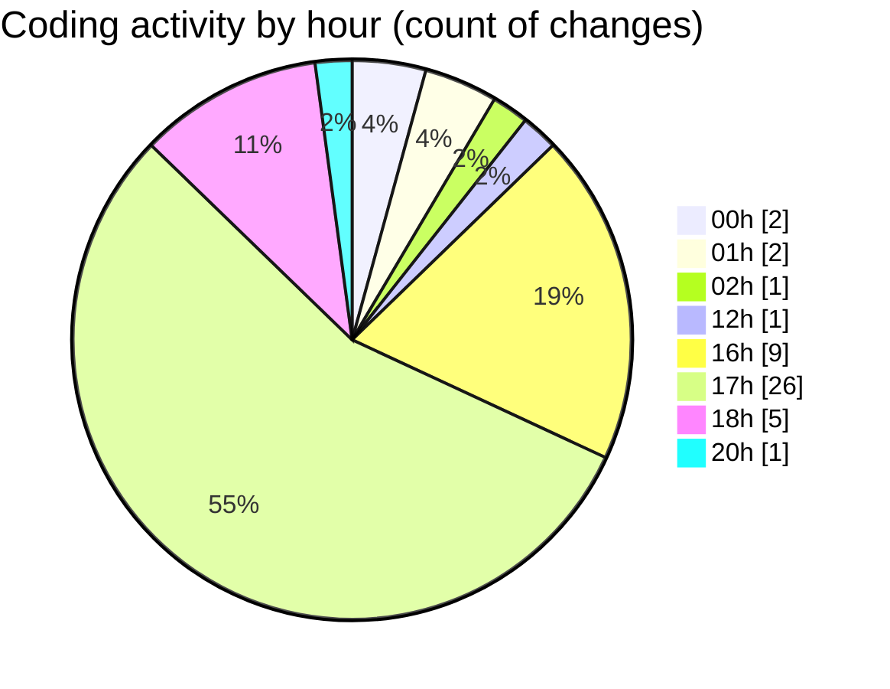

# twenty_versions_aminor - Activity Summary 

## Overall Statistics

| Stat                   | Value                                                             |
| ---------------------- | ----------------------------------------------------------------- |
| **Lines Added** (➕)   | 8381                                          |
| **Lines Removed** (➖) | 98                                        |
| **Net Change** (↕)    | 8283                |
| **Active Time** (⌚)   | 63 minutes |

## Modified Files
- **full_track_assembler.py** (+275, -0)
- **chordEngine.js** (+325, -0)
- **shibass-music-system.html** (+2179, -71)
- **settings.json** (+6, -0)
- **settings.json** (+56, -27)
- **stock-investor-routes.js** (+387, -0)
- **future_projection_calculator.json** (+49, -0)
- **business-os-routes.js** (+270, -0)
- **shibass-command-center.html** (+1537, -0)
- **panel_tabs.json** (+8, -0)
- **panel_tabs.json** (+8, -0)
- **AGENT_REGISTRY.json** (+332, -0)
- **remote_pc_registry.json** (+24, -0)
- **sb-ops.html** (+975, -0)
- **sb-ops.html** (+975, -0)
- **sb-ops.html** (+975, -0)

## Visualizations

### By File Type (Lines Changed)

### By Hour (Estimated Activity Count)

> **Last Updated:** 7/9/2026, 8:17:51 PM