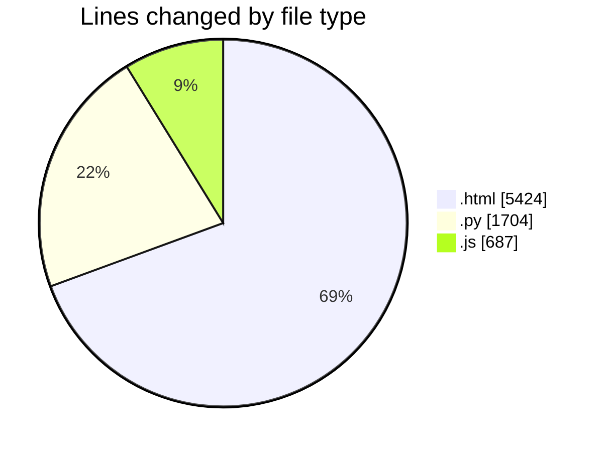
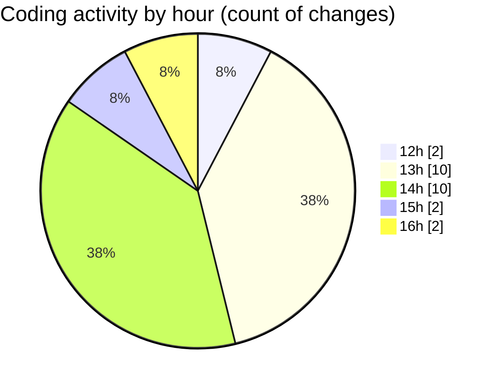

# Untitled (Workspace) - Activity Summary 

## Overall Statistics

| Stat                   | Value                                                             |
| ---------------------- | ----------------------------------------------------------------- |
| **Lines Added** (➕)   | 7813                                          |
| **Lines Removed** (➖) | 2                                        |
| **Net Change** (↕)    | 7811                |
| **Active Time** (⌚)   | 15 minutes |

## Modified Files
- **project-learning-center.html** (+5422, -2)
- **run_host_audit.py** (+681, -0)
- **parse_cpr_test.py** (+28, -0)
- **build_digital_twin.py** (+995, -0)
- **sb-player.js** (+687, -0)

## Visualizations

### By File Type (Lines Changed)

### By Hour (Estimated Activity Count)

> **Last Updated:** 7/12/2026, 4:14:47 PM