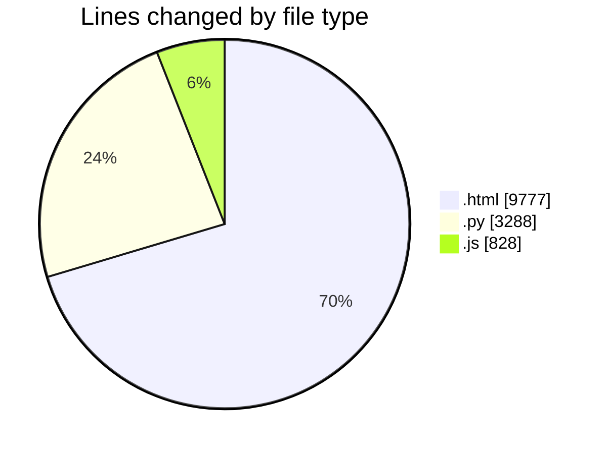
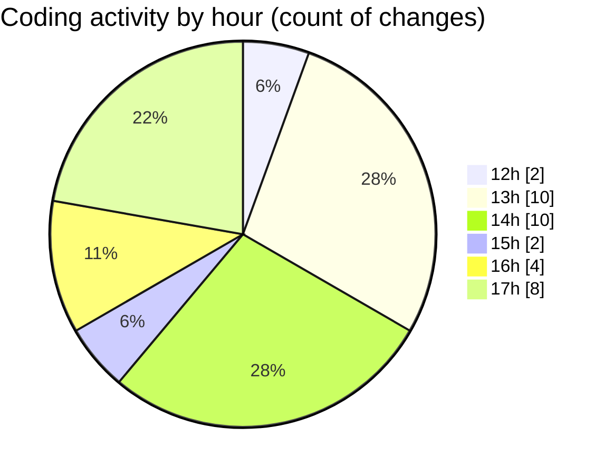

# Untitled (Workspace) - Activity Summary 

## Overall Statistics

| Stat                   | Value                                                             |
| ---------------------- | ----------------------------------------------------------------- |
| **Lines Added** (➕)   | 13891                                          |
| **Lines Removed** (➖) | 2                                        |
| **Net Change** (↕)    | 13889                |
| **Active Time** (⌚)   | 26 minutes |

## Modified Files
- **project-learning-center.html** (+9775, -2)
- **run_host_audit.py** (+681, -0)
- **parse_cpr_test.py** (+28, -0)
- **build_digital_twin.py** (+995, -0)
- **sb-player.js** (+828, -0)
- **run_continuous_training_autopilot_v2.py** (+643, -0)
- **test_safe_mode_dismissal.py** (+123, -0)
- **run_controlled_test.py** (+795, -0)
- **get_cubase_window_pid.py** (+23, -0)

## Visualizations

### By File Type (Lines Changed)

### By Hour (Estimated Activity Count)

> **Last Updated:** 7/12/2026, 5:49:04 PM