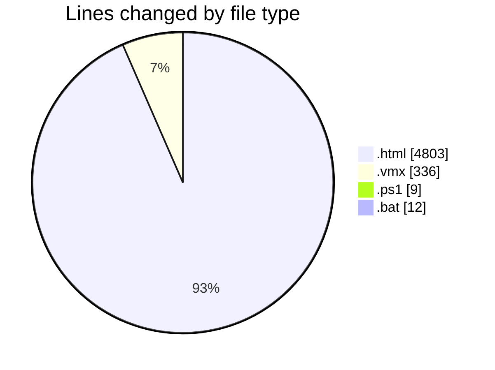
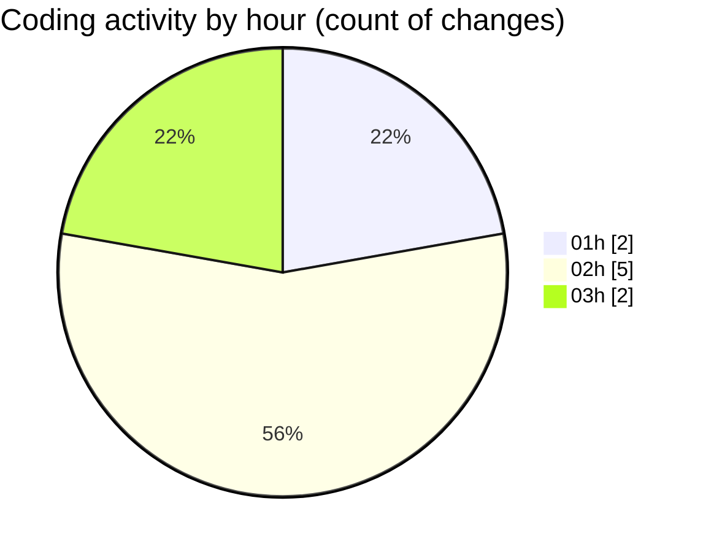

# Untitled (Workspace) - Activity Summary 

## Overall Statistics

| Stat                   | Value                                                             |
| ---------------------- | ----------------------------------------------------------------- |
| **Lines Added** (➕)   | 5140                                          |
| **Lines Removed** (➖) | 20                                        |
| **Net Change** (↕)    | 5120                |
| **Active Time** (⌚)   | 8 minutes |

## Modified Files
- **project-learning-center.html** (+4803, -0)
- **SHIBASS-CUBASE-MIDI-WORKER.vmx** (+157, -15)
- **Ubuntu 64-bit.vmx** (+159, -5)
- **read_flp.ps1** (+9, -0)
- **map_ubuntu_drive.bat** (+12, -0)

## Visualizations

### By File Type (Lines Changed)

### By Hour (Estimated Activity Count)

> **Last Updated:** 7/13/2026, 3:15:26 AM