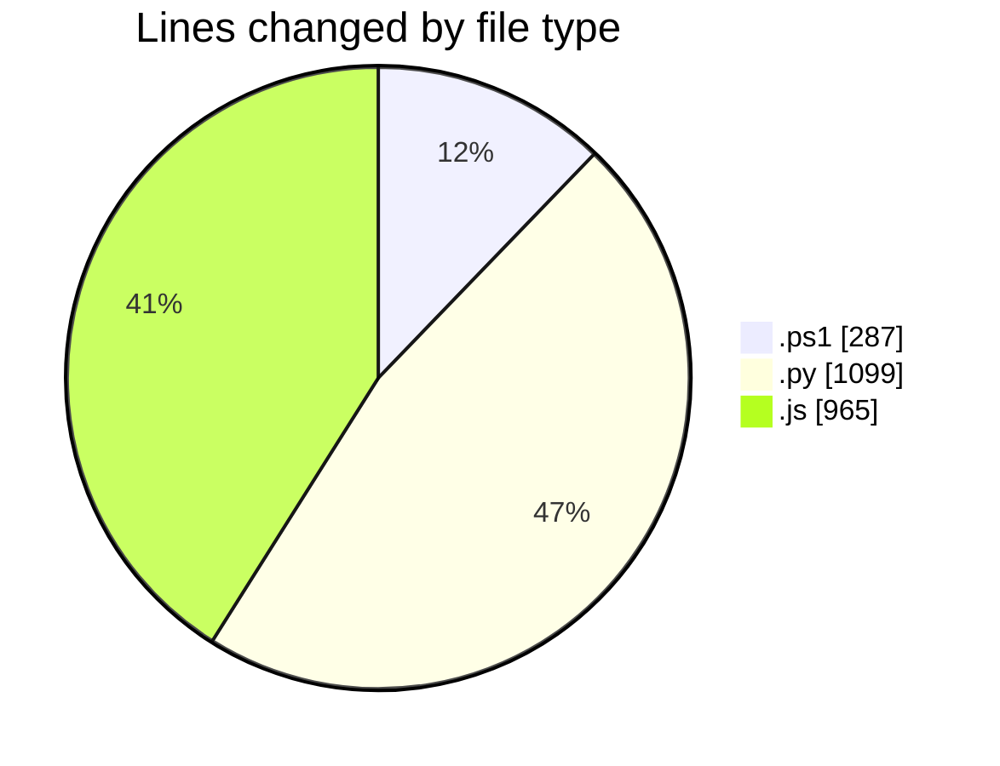
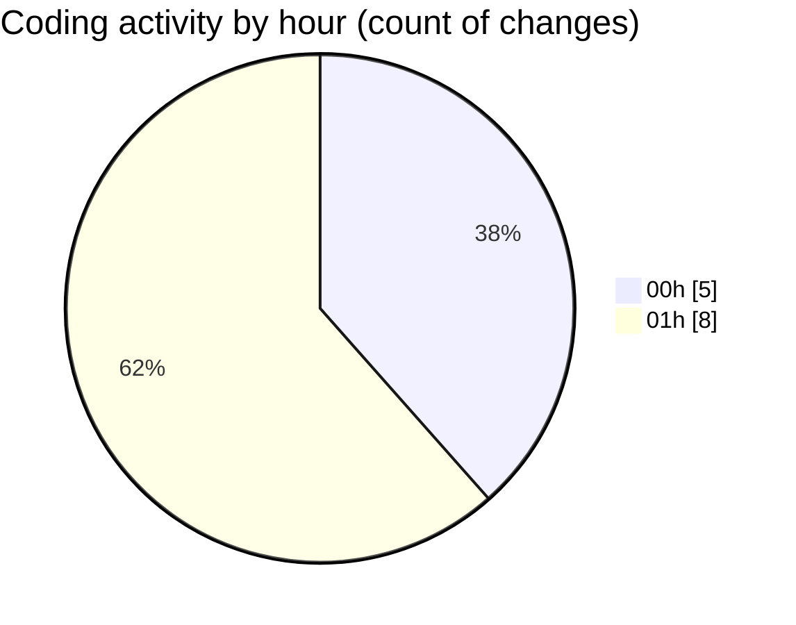

# shibass-ai - Activity Summary 

## Overall Statistics

| Stat                   | Value                                                             |
| ---------------------- | ----------------------------------------------------------------- |
| **Lines Added** (➕)   | 2350                                          |
| **Lines Removed** (➖) | 1                                        |
| **Net Change** (↕)    | 2349                |
| **Active Time** (⌚)   | 21 minutes |

## Modified Files
- **scan_subnets.ps1** (+54, -0)
- **start_node_panel.py** (+1099, -0)
- **CONNECT_LAPTOP_AUTOMATIC.ps1** (+214, -0)
- **restart_server.ps1** (+19, -0)
- **fleet-routes.js** (+737, -1)
- **simulate_fleet.js** (+227, -0)

## Visualizations

### By File Type (Lines Changed)

### By Hour (Estimated Activity Count)

> **Last Updated:** 7/14/2026, 1:44:58 AM